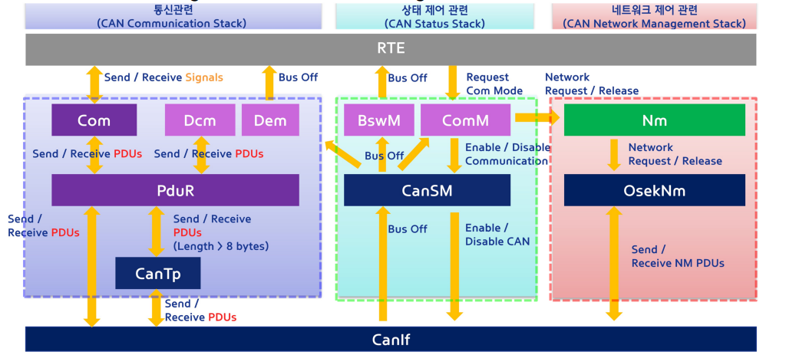

## Layered software architecture

# AUTOSAR Communication Layers

### **차량 네트워크 통신 및 관리 서비스 (Vehicle Network Communication and Management Services)**
   - **CAN 통신 스택 (CAN Communication Stack)**: 차량 내 다양한 ECU 간 신호 전송 및 수신을 담당하는 계층이다. Com 모듈을 통해 PDUs를 주고받으며, 네트워크 상태를 관리한다.
   - **CAN 상태 관리 스택 (CAN Status Stack)**: CAN 네트워크의 상태를 모니터링하며, 네트워크 오류 및 장애 상황을 처리한다.
   - **CAN 네트워크 관리 스택 (CAN Network Management Stack)**: 네트워크 요청 및 해제를 처리하며, NM 모듈이 네트워크 내 노드들의 통신 상태를 제어한다.

### **진단 서비스 (Diagnostic Services)**
   - **Dcm (Diagnostic Communication Manager)**: 진단 통신을 관리하며, 차량의 다양한 진단 요청에 대한 응답을 처리한다. 이는 차량 진단 프로토콜(UDS 등)을 지원하여 오류 코드 등을 읽고 처리한다.
   - **Dem (Diagnostic Event Manager)**: ECU 내에서 발생한 진단 이벤트를 관리하며, 이벤트 기록 및 보고를 담당한다. 차량의 오류 상황을 모니터링하고 문제 해결에 도움을 준다.

### **ECU 상태 관리 및 모드 관리 (ECU State Management and Mode Management)**
   - ECU가 여러 동작 모드 간 전환을 원활하게 수행하도록 지원하며, 차량의 효율적 운영을 보장한다. 특히, 시스템의 전반적인 동작 흐름을 유지하기 위해 각 ECU 간의 통합된 모드 관리가 중요하다.

### **CAN Communication Stack (통신관련)**
   - PDU(Protocol Data Unit)와 신호의 송수신을 담당한다.
   - `Com`, `Dcm`, `Dem`, `PduR`, `CanTp` 등의 구성 요소를 포함한다.

### **CAN Status Stack (상태 제어 관련)**
   - 통신 상태를 관리하고, 버스 오프 조건을 처리한다.
   - `CanSM`, `BswM`, `ComM` 등의 구성 요소를 포함한다.

### **CAN Network Management Stack (네트워크 제어 관련)**
   - 네트워크 요청과 해제를 관리하며 네트워크 관리 통신을 담당한다.
   - `Nm`, `OsekNm` 등의 구성 요소를 포함한다.

#### 주요 구성 요소:
- **Com**: CAN 통신 스택 내에서 PDU로 신호를 송수신하는 역할을 한다.
- **Dcm (Diagnostic Communication Manager, 진단 통신 관리자)**: UDS(통합 진단 서비스)와 관련된 진단 통신을 관리한다.
- **Dem (Diagnostic Event Manager, 진단 이벤트 관리자)**: 진단 이벤트를 관리하며, 오류 보고 및 진단 트러블 코드(DTC)를 저장한다.
- **PduR (PDU Router, PDU 라우터)**: 통신 계층과 모듈 간에 PDU를 라우팅한다.
- **CanTp (CAN Transport Protocol, CAN 전송 프로토콜)**: 8바이트 이상 길이의 PDU를 분할하여 전송할 수 있도록 처리한다.
- **CanSM (CAN State Manager, CAN 상태 관리자)**: CAN 네트워크 상태를 관리하며, 네트워크 활성화 및 비활성화를 제어한다.
- **BswM (Basic Software Mode Manager, 기본 소프트웨어 모드 관리자)**: 시스템 이벤트와 조건에 따라 기본 소프트웨어 모드를 전환한다.
- **ComM (Communication Manager, 통신 관리자)**: ECU의 전체 통신 모드를 관리하며, 통신 모드 간의 전환을 처리한다.
- **Nm (Network Management, 네트워크 관리)**: 네트워크 요청과 해제를 관리하며, 네트워크 조정을 담당한다.
- **OsekNm**: OSEK 표준에 따른 네트워크 관리 구현으로, 네트워크 관리 PDU를 처리한다.

#### 상호작용:
- PDU와 신호는 이러한 구성 요소 간에 교환된다.
- RTE(런타임 환경)는 통신 스택, 상태 제어 스택, 네트워크 관리 스택을 연결하여 각 계층 간 상호작용을 가능하게 한다.

이미지는 이러한 구성 요소들이 CAN 통신 시스템 내에서 어떻게 상호작용하며 데이터를 전달하고 네트워크를 관리하며 진단을 처리하는지를 보여준다.

## Flow through Layered

- **SDU (Service Data Unit)**
  - 상위 계층에서 전달된 데이터.
  - 하위 계층에서 수신 후 추출되는 데이터.

- **PCI (Protocol Control Information)**
  - 하나의 프로토콜 계층에서 다른 인스턴스로 SDU를 전달하기 위해 필요한 정보.

- **PDU (Protocol Data Unit): SDU + PCI**
  - PDU는 상위 계층에서 하위 계층으로 전달되며, 하위 계층에서는 이 PDU를 자신의 SDU로 해석합니다.
  - ID, 길이, 데이터(버퍼), 참조로 구성됩니다.

## **Communication Services - General**

- 차량 네트워크 통신(CAN, LIN, FlexRay, Ethernet)을 위한 모듈 집합이다.
- 통신 하드웨어 추상화를 통해 통신 드라이버와 인터페이스를 제공한다.

#### 주요 제공 기능:
- 차량 네트워크를 위한 통합된 통신 인터페이스를 제공한다.
- 네트워크 관리를 위한 일관된 서비스를 제공한다.
- 진단 통신을 위한 일관된 인터페이스를 제공한다.
- 애플리케이션에서 프로토콜 및 메시지 속성을 숨긴다.

#### 구현은 마이크로컨트롤러(μC)와 ECU 하드웨어에 독립적이며, 버스 타입에 부분적으로 의존한다.

# AUTOSAR CAN Communication Layers