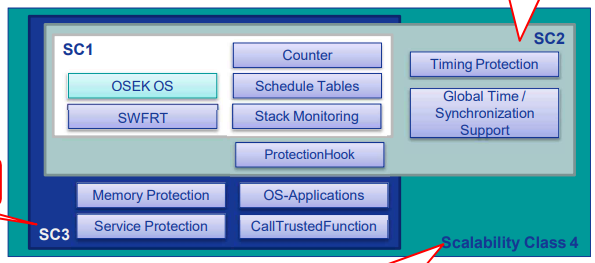

# AUTOSAR OS

## AUTOSAR OS 개요
    - 기존의 OSEK OS를 기반으로 하여 추가적인 기능들이 부가됨.
    - 예) [SRS_OS_00097] The OS shall provide an API that is backward compatible to the API of OSEK OS.

### Scalability Class (확장성 제공)
- 기존 OSEK OS에서 사용자의 목적에 따른 확장성을 제공 (SC1/SC2/SC3/SC4)
- Application에서 필요한 기능에 따라 선택 가능
  - **SC1**: OSEK OS를 포함한 기본 기능
  - **SC2**: SC1 + Timing Protection 등
  - **SC3**: SC1 + Memory Protection 등
  - **SC4**: SC2 + SC3

#### Scalability 1의 주요 Service 기능
- **OSEK OS**: AUTOSAR는 backward compatibility가 되도록 OSEK OS의 API를 지원
- **SWFRTI (Software free-run timer)**: OS에서 사용하는 타이머를 설정
- **Counter**: OSEK OS의 Counter를 직접 제어할 수 있는 API 추가
- **Schedule Table**: 여러 동작을 시간에 따라 수행하게 하기 위해 OS에서 제공하는 expiry points들의 집합
- **Stack Monitoring**: Stack이 설정된 값보다 초과되어 사용되고 있지 않은지 검사하는 OS 서비스

#### Scalability 2의 주요 Service 기능
- **Protection Hook**: 치명적인 에러 발생 시 사용자가 선택한 동작을 수행하게 하는 hook mechanism
- **Timing Protection**: Task가 제시간에 동작하는 것을 보장하기 위하여, task 수행시간, resource 점유 시간, activation 주기 등을 감시하는 서비스
