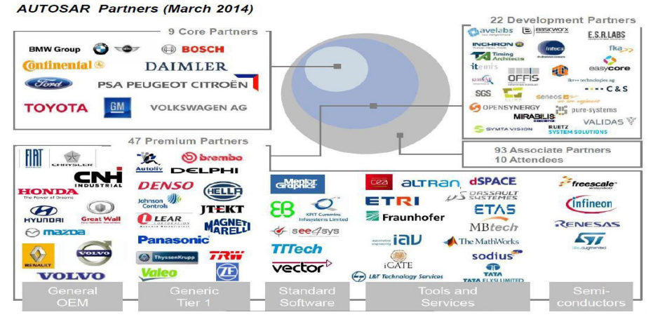
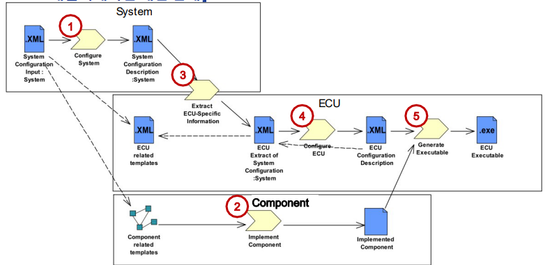
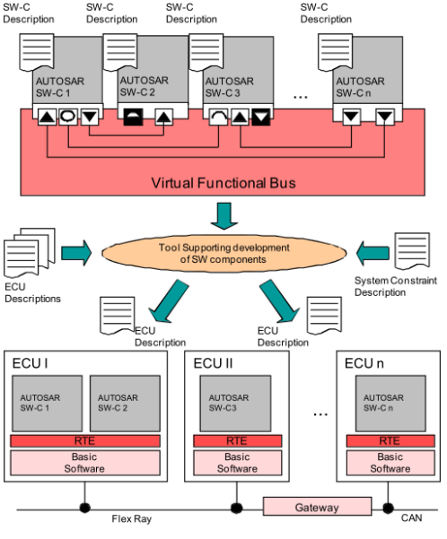
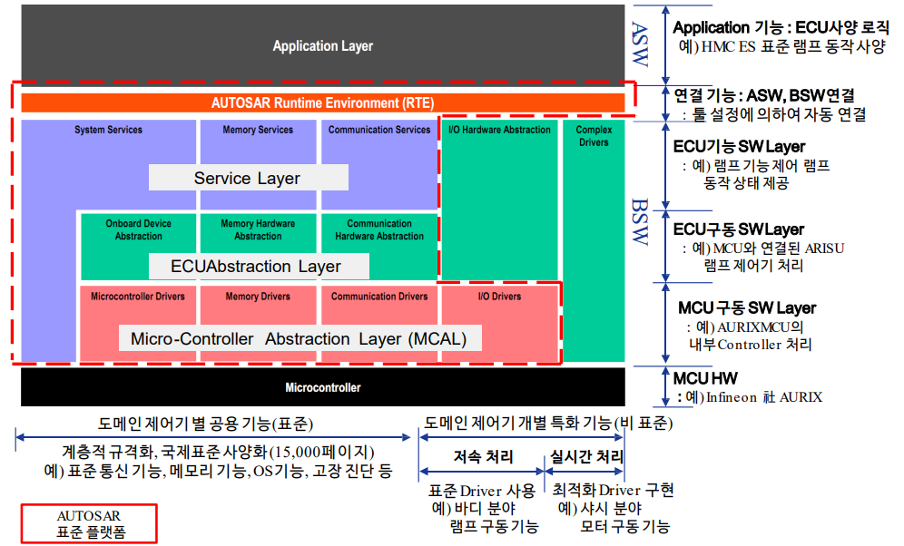

# 소프트웨어 플랫폼

### 소프트웨어 플랫폼 개요

- **제어계층에서 응용 SW와 HW를 연결해주는 중간 계층**
- **표준 인터페이스와 공통 기능 모듈 제공**

### PC와 소프트웨어 플랫폼 비교

| 구분     | 제어기                                             | PC (컴퓨터)                          |
|----------|----------------------------------------------------|--------------------------------------|
| 응용 SW  | 각 제어기별 기능 SW (Auto Light, Wiper, Room Lamp) | 응용 S/W (Excel, Outlook, Printer Driver)    |                                                    |                                      |
| SW 플랫폼 | 공통 기능 모듈, 표준 인터페이스 + Tool            | Framework (Windows OS, Mainboard driver, Graphic driver, AUDIO driver) |
| HW       | MCU, ECU 보드                                      | CPU (Intel Core2 Quad, AMD Phenom X7) |
| 외부 장치 | 와이퍼, 실내/외등, 멀티 Function 스위치          | 모니터, 키보드, 마우스               |
### 소프트웨어 플랫폼 개발 배경

- **제어기 수량의 증가 및 차량 공간의 제약에 따라 제어기 통합 필요**
- **제어기 SW의 복잡성이 증가함에 따라 플랫폼 공용화 및 표준화 필요**

### 표준 플랫폼 개발 필요성

- **제어기 수량의 증가/공간의 제약**
   - #### 차량 내 제어기의 수가 증가함에 따라 통합이 요구됨.
            제어기 통합 설계 환경 (소프트웨어 플랫폼)
            - 여러 기능을 수행하는 제어기들이 공통된 소프트웨어 플랫폼을 기반으로 통합됨.
            - 예: Lamp 제어, Wiper 제어, Door 제어, 바디 제어, 섀시 제어, P/T 제어 등.

- **제어기 SW 복잡도 증가**
   - #### 제어기 소프트웨어의 복잡성이 증가하면서 공용화와 표준화의 필요성이 대두됨.
            편의 표준 플랫폼
            - AUTOSAR 플랫폼으로의 전환이 진행 중.
            - '08년도부터 현대차에서 공동 개발을 진행 중이며, 현재 양산화 개발이 완료됨.

### HKMC 표준 플랫폼 비교 (XENON AUTOSAR)

- **최신 차량용 기반 기술의 국제 표준화 및 사양화**
- **고성능 MCU 사용으로 플랫폼 적용 도메인 확대 및 전 분야 공용 표준화 플랫폼 제공**
- **차세대 통신기술 제공 및 기능안전(IS026262) 대응**

### HKMC 표준 플랫폼 비교

| 구분 | 국제 표준 플랫폼 (AUTOSAR) | Local 표준 플랫폼 (XENON) |
| ---- | ------------------------- | -------------------------- |
| **기술 동향** | 최신 차량용 기반 기술의 국제 표준화/사양화, MCU의 고성능화 | 최신 차량용 기반 기술의 국제 표준화/사양화, MCU의 고성능화 |
| **주요 사양** | ISO 26262 기능안전사양, 고성능 MCU (Multi-Core), 이더넷 기반 차세대 통신 | 일반 MCU (Single-Core), 일반 통신 (CAN, LIN) |
| **적용 분야** | 전 분야 공용화 플랫폼, Cross Domain 통합 | 편의 분야 통합, 편의 분야 표준 사양 |
| **지원 MCU** | RH850, MPC57, AURIX 등 차기 MCU군 위주 ('15년~) | 예) XC22xxM (16비트, 80MHz), Flash (Max768KB), RAM (50KB) |
   
# AUTOSAR
- ### **AUTOSAR**
        - Automotive Open System Architecture의 약자로, 자동차 소프트웨어의 표준화와 모듈화를 목표로 하는 글로벌 파트너쉽

        - AUTOSAR는 새로운 기술 발전에 대비하고, 품질을 유지하면서도 비용 효율성을 극대화하는 것을 목표로 하는 중요한 기술
- **목표**:
  - 성능, 안전성, 친환경성을 갖춘 전장 시스템 혁신.
  - 복잡해지는 전장 시스템을 효율적으로 관리하고, 품질 및 비용 효율성을 향상.
  - 소프트웨어와 하드웨어의 교체나 업데이트를 자동차 수명 전반에 걸쳐 가능하게 함.
- **협력**:
  - "Cooperate on standards, compete on implementation"이라는 원칙 아래 글로벌 파트너십을 형성.
### AUTOSAR 운영조직
- **참여 정도에 따라 4개의 영역으로 구성**:
  - **Core Partner** : 조직 및 행정 관리.
  - **Premium Partners** : Working group의 선도 및 개선.
  - **Development Partners** : 전문 지식 기여.
  - **Associate Partners** : AUTOSAR 표준 사용자.

### 국제 개발 동향

- **해외 주요 OEM 동향**: AUTOSAR 4.x 주도적 추세
  - **Audi, Benz, VW**: AUTOSAR 3.x 적용 선도
  - **BMW, Volvo**: AUTOSAR 4.x 적용 선도 (`15년 Q3, 최초 양산 적용 예정)
  - **GM, PSA, Toyota**: 대부분 OEM이 AUTOSAR 4.x 적용 (`17년, 양산 적용 예정)

- **HKMC AUTOSAR 대응**: `15년 이후 양산 차종 제어기 적용 개발 시작 (AUTRON 플랫폼)   

# AUTOSAR 플랫폼
### AUTOSAR 개발 과정

- **AUTOSAR 소프트웨어 개발 순서**
  1. **Configure System** : 시스템 설정 단계로 컴포넌트의 구성/연결 등을 정의한다. (Software Component Description을 개발)
  2. **Implement Component** : "Configure System" 단계에서 구성한 컴포넌트들에 대한 코드 구현 등을 진행한다.
  3. **Extract ECU-Specific Information** : 시스템 구성 정보로부터 특정 제어기 소프트웨어를 구현하기 위한 정보만을 추출한다.
  4. **Configure ECU** : 제어기 관련 설정을 진행한다. (ECU Configuration Description 개발)
  5. **Generate Executable** : 제어기에서 동작하는 실행 파일을 생성한다. (컴파일 및 링크를 통해 실행 이미지를 생성)

- **AUTOSAR 개발 과정**은 일반적으로 Top-down 방식으로 계발됨
- 시스템 설계자는 VFB 상에서 SW-C를 설계. SW-C 간 Data의 이동은 Port와 Interface로 정의
- **Configure System**이라는 디자인 단계에서 SW-C는 특정 ECU에 할당. ECU Extract 과정을 통해 개발 ECU에 설계 정보 전달
- 개발 ECU는 SW-C 간 또는 SW-C와 BSW 간 구체적인 인터페이스를 RTE를 통해 구현

    ### 
        SW-C : Software Component. 일반적으로 소프트웨어 기능 단위 AUTOSAR에서 애플리케이션은 서로 연결된 컴포넌트의 구성을 통해 모델링
        VFB : Virtual Functional Bus. 컴포넌트가 상호작용 할 수 있는 통신 메커니즘
        RTE : Run-Time Environment. SW-C 간 또는 SW-C와 BSW간 인터페이스를 설정을 통해 자동 생성해 주는 기능

### AUTOSAR 플랫폼 구조

- 차량용 SW Application 개발의 생산성 향상을 위한 표준 플랫폼
  - 계층화된 구조 사용으로 업체별 개발 분담 가능 (Application, BSW, MCAL)
- AUTOSAR 표준 준수를 통한 안전성 확보
- H/W와 독립적인 구조로 SW Application 재사용 가능

### AUTOSAR Layered Software Architecture
- #### Application Layer
    - H/W 독립적인 응용 프로그램 S/W를 정의
    - SWC의 종류는 기능에 따라 Application, Actuator, Sensor 등으로 구별
    - SWC 간 통신 및 SWC와 BSW 사이의 통신은 RTE를 이용
- #### Runtime Environment (RTE)
    - VFB로 모델화된 통신 구조가 실제 로컬 연결이나 네트워크 통신으로 구현된 환경
    - Application Layer의 SWC 간, SWC와 BSW 사이 Communication Service 제공
    - ECU에 독립적인 Interface Mapping을 SWC에 제공
    - RTE에 정의된 표준 인터페이스만을 이용하여 SWC 개발 가능
- #### Basic Software Layers (BSW)
    - **Services Layer**: 
        - 시스템 구동 및 다른 BSW 모듈 제어를 위한 관리 서비스 제공

    - **ECU Abstraction Layer**: 
        - MCAL 드라이버들을 상위 계층에 Interface하는 추상화 계층
        - 외부 장치들을 사용하기 위한 드라이버 포함 (예: Ext Wdg, Ext EEPROM 등)

    - **Micro-Controller Abstraction Layer (MCAL)**:
        - MCU 내부 장치를 이용하기 위한 드라이버들로 구성

    - **Complex Drivers**:
        - AUTOSAR 표준에 정의되지 않은 기능 구현을 위한 계층   
# AUTOSAR의 장점
### SW Reusability

- **SW 플랫폼을 통한 HW 독립적인 SW 애플리케이션 설계 및 재사용**
  - 높은 재사용성을 통한 비용 절감
  - SWC 사이의 안정적인 연결 제공
  - 표준화된 플랫폼 사용으로 HW가 변경되어도 기존 SW 재사용 가능

### SW Safety
- 안전이 검증된 S/W의 재사용 가능 -> 안전성 확보
- 표준화된 프로세스에 의한 S/W 개발로 인한 안전성 증대
### Cost Efficiency
- **OEM 측면**
  - S/W 재사용, 신차 모델 개발 기간 단축으로 인한 원가 절감
  - OEM의 설계 요구사항을 담고 있는 ARXML을 통해 부품사와 명확한 커뮤니케이션 가능
  - 다양한 부품사에서 기능을 제공받아 통합 가능

- **Supply 측면**
  - 다양한 OEM에 공급 가능
    - AUTOSAR 사용 -> AUTOSAR 표준을 준수하고 있는 타 OEM에 공급 가능
- 기존 : OEM별 별도 사양으로 생산
