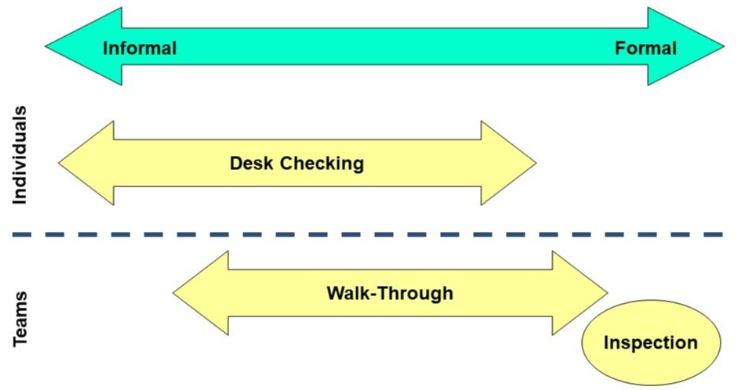

## 정적(Static) 테스트

- 소프트웨어를 실행하지 않고 결함을 찾아내는 것
- 여러 참가자들이 모여 소프트웨어를 검토하여 결함을 찾아내거나 정적 검증 도구 이용
- 소프트웨어 개발 중에 생성되는 모든 산출물들에 대해서 적용 가능

    ### 대표적인 방법
    - **동료 검토(Peer Review)**
        - 인스펙션(Inspection)
        - 워크스루(Walk-through)
        - 데스크체크(Desk Check)
    
    - **도구를 이용한 정적 분석**
        - 툴 기반 정적분석(PMD, BugFind 등)
        - 의존성 분석

## 결함 발생 원인

- **Communication**
  - 10명의 사람이 있으면 45개의 Path가 생성

- **Short Term Memory**
  - 사람이 관리할 수 있는 범위 (7digit)
  - 여러 가지 Interruption이 발생

- **Cognitive Dissonance**
  - 자신의 산출물에서 결함을 찾기가 힘듦

- **Complexity of Work**
  - 설계로서의 복잡성으로 Code 작성이 어려운 경우 발생
###
    아무리 능숙한 프로그래머라도 평균적으로 35 Defs/KLoc 발생

## 정적 테스트 단계에서 식별 가능한 결함

- **요구사항 결함** : 불일치, 모호성, 오논, 누락, 부정확성, 중복 등

- **설계 결함** : 비효율적인 데이터베이스 구조, 모듈화 불량 등

- **특정 유형의 코딩 결함** : 정의되지 않은 값을 가진 변수, 선언되지 않은 변수, 도달할 수 없는 코드, 중복 코드, 과도한 코드 복잡성 등

- **표준 위반사항** : 코딩 표준, 명명 규칙을 준수하지 않은 경우 등

- **잘못된 인터페이스 명세** : 매개변수의 개수, 유형, 순서 불일치 등

- **특정 유형의 보안 취약성** : 버퍼 오버플로우 등

- **테스트 베이시스 커버리지의 차이 또는 부정확성** : 인수 조건 하나에 대한 테스트 누락 등

## 동료 검토
### 정의

- **"기술적인 내용이나 품질을 평가하기 위해 저자와 동료에 의해 산출물을 평가하는 소프트웨어 검토의 방법"**
  - 리뷰 대상: 소프트웨어 계획, 요구사항, 디자인, 코드, 테스트 절차, 테스트 케이스 등

- TTA 용어사전 :  **"시스템이나 시스템 컴포넌트 또는 소프트웨어 프로그램의 결함이나 개선 사항을 발견하기 위하여 개발 당사자를 제외한 주된 동료가 시스템 문서 및 프로그램 코드(code)를 검토, 분석하고 개선 사항을 제안하는 작업"**

- CMMI : **"결함 제제를 목적으로 결함을 발견하기 위해 산출물을 개발 당사 동료에 의해 수행되는 검토 방법"**

### 유형

| **비공식 리뷰(Informal Review)** | **공식 리뷰(Formal Review)** |
|----------------------------------|------------------------------|
| 공식적인 절차, 표준 존재하지 않음 | 공식적인 절차, 표준 존재 |
| 참여자 별 역할과 책임이 명확하지 않음 | 참여자 별 역할과 책임이 명확 |

### 프로세스
-  체크리스트를 통해 검토를 진행해야 한다
    - **사전 준비** :  공지 -> 검토자 지정 -> 배포 -> 준비
    - **검토 회의** :  문제점 해결 -> 보고서 작성
    - **후속 조치** :  시정 조치 -> 조치 보고
### 소스코드 동료검토 주의사항

1. **한 번에 200~400 라인 이내의 단위로 검토**
2. **시간당 300~500라인 보다는 적게 본다는 느낌으로 검토**
3. **검토를 요청하는 개발자는 다른 사람에게 어떤 내용인지 설명을 해주는 것이 좋다**
4. **명확한 목표치를 갖는 것이 중요**
5. **결함이 실제로 고쳐졌는지를 확인하는 것이 중요**
6. **관리자는 결함 발견을 긍정적으로 보는 문화를 조성해야 한다**
7. **아무리 시간이 없어도 일부 코드만이라도 검토를 해야 한다**
8. **동료가 자신의 코드에 오류를 많이 발견한다고 해서 너무 기록지 않는다**

## 인스펙션 (Inspection)
- 1970년대 초 IBM의 마이클 페이건에 의해 정립
- 표준이나 명세서에 대한 편차와 에러를 포함한 결함을 발견하고 식별하기 위해 작업 산출물에 대해 수행하는 검사
  [ISO 8402-1995]
    ### 주요 특징
    - 검토한 산출물의 작성자가 아닌, 훈련된 진행자(Moderator)에 의한 진행
    - 시작과 종료 조건을 갖춘 체크리스트와 규칙을 기반으로 하는 정식 프로세스가 존재
    - 소프트웨어 구성요소 혹은 산출물들의 정확성 평가
    - 전문가 검토이며 공식적 평가
    - 결함 발견이 주요 목적
        - 소프트웨어가 명세를 만족하는지 검증
        - 소프트웨어가 명시된 품질 속성을 만족하는지 검증
        - 소프트웨어가 아키텍처에서 규격, 표준, 가이드라인, 계획 및 프로시저와 일치하는지 검증
        - 표준이나 규격과 상이한 부분 식별
        
## 워크스루 (Walkthrough)
- 개발자 위주, 비공식적인 검토과정
- 각 개발 담당자가 서로 협력하는 자주적인 리뷰
- 디자이너나 개발자가 개발팀과 다른 관심 있는 사람들을 이끌며 진행하는 작업 산출물에 대한 정적인 분석방법
  [IEEE Std 1028-1997]

    ### 주요 특징

    - **작성자에 의해 진행 및 제어**
    - **시간 및 인원수 등에 제한이 없고, 상황에 따라 변경할 수 있음**
    - **시스템에 대한 이해 향상 및 결함발견 목적**

## 워크스루 vs 인스펙션

| 구분       | 검토시점                     | 검토대상         | 진행주체           | 검토규정                      | 검토산출물                 | 후속처리           |
|------------|------------------------------|------------------|--------------------|------------------------------|---------------------------|--------------------|
| **워크스루** | 임의 시점 (개발 산출물 작성 중) | 중간 산출물       | 개발 산출물 작성자 | 정식 검토 규정 및 프로세스가 존재하지 않음 | -                         | -                  |
| **인스펙션** | 개발 산출물 작성 완료시       | 개발 산출물 완성본 | 훈련된 리더        | 정식 검토 규정 및 프로세스가 존재함       | 인스펙션 결과서, 결함 리포트 | 검토 작업의 후속처리 프로세스 존재 |

## 정적분석
### 정의
- 실제 실행 없이 컴퓨터 소프트웨어, 특히 소스코드를 분석하는 것

### 사용 목적
- 소스코드의 잠재적인 품질 문제 발견
  - 네트워크 자원 누수, 높은 복잡도, 추천하지 않는 패턴 등
  - 네트워크 자원 누수 예) 네트워크 소켓의 open()은 있으나, 명시적인 close()가 없는 경우
- 결함의 조기 발견
  - 메모리 릭, 버퍼 오버플로우 등
- 소스코드 표준 준수 확인
  - 코딩 컨벤션(명명규칙), 보안
- 설계 상의 낮은 품질, 표준 위반 확인

### 정적분석 도구의 구분
- 룰 기반 정적분석
- 의문점 분석
  - 시멘틱 분석(실행 오류 분석)
- 정형 검증

## 룰 기반(Rule based) 정적분석 소개

### 개요
- 사전에 정해진 룰 가이드라인을 소스코드가 만족하는지 분석하는 도구
  - 룰 가이드라인은 검증 도구가 해석할 수 있는 룰과 이에 대한 가이드를 구성되며, 룰셋은 룰을 카테고리화한 것
  - 예제 참고

### 대표적인 룰 가이드라인 (코딩 표준)
- **MISRA** : Motor Industry Software Reliability Association에서 개발한 안전성, 호환성, 신뢰성을 위한 C, C++ 룰
- **CERT** : SEI CERT(Computer Emergency Response Team)의 SW 개발보안을 위한 C, C++, Java 룰
- **행정자치부 개발보안(시큐어 코딩)** : 행정기관의 SW 개발보안을 위한 JAVA, C, Android-Java 룰
