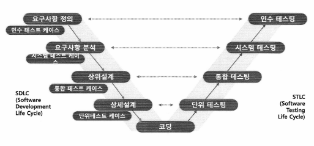

## SW 테스트 종류

- ### 정적(Static)인 방법
  - 소프트웨어를 실행하지 않고 결함을 찾아내는 것
  - 여러 참가자들이 모여 소프트웨어를 검토하여 결함을 찾아내거나 정적 검증 도구 이용
  - 소프트웨어 개발 중에 생성되는 모든 산출물들에 대해서 적용 가능

  ##### 대표적인 방법
        - 동료검토(Peer Review)
            - 인스펙션(Inspection)
            - 워크스루(Walk-through)
            - 데스크체크(Desk Check)
        - 도구를 이용한 정적 분석
            -  Tool 기반 정적분석(PMD, BugFind 등)

- ### 동적(Dynamic)인 방법
  - 소프트웨어를 실행하여 결함을 찾아냄
  - 발견된 결함은 디버깅 활동으로 확인하여 수정함

  ##### 대표적인 방법
        - 테스트
            - 블랙박스/명세기반 테스트
            - 화이트박스/구조기반 테스트

## Error, Defect, Failure 용어 정의
#### 에러(Error)
    결함의 원인으로 사람(SW 개발자, 분석가 등)에 의하여 생성된 실수가 주를 이룸

#### 결함(Defect, Fault), 버그(Bug)
    실패/고장 또는 문제의 원인으로 제품에 포함된 결점

#### 실패/고장(Failure), 문제(Problem)
    제품의 결함(Defect)이 있는 부분이 실행될 때 발생되는 현상

## 소프트웨어 테스트 프로세스 (from ISO/IEC/IEEE 29119)
- **테스트 계획 (Test Planning)**
- **테스트 모니터링 및 제어 (Test Monitoring and Control)**
- **테스트 분석 (Test Analysis)**
- **테스트 디자인 (Test Design)**
- **테스트 구현 (Test Implementation)**
- **테스트 실행 (Test Execution)**
- **테스트 완료 (Test completion)**

### [예시] KT의 SW 테스트 프로세스
    1. Test Planning and Control
        - 테스트 목적/목표 설정 및 대상 연구
        - 테스트 전략 개발
            - 리스크 분석
            - 전략 수립
        - 테스트 종료 조건
        - 테스트 추정
        - 조직구성
        - 테스트 계획
        - 테스트 관리 및 제어
        - 모니터링 (reporting)
            - reporting 절차/체계
            - 진행 reporting
# //////////////
    2. Test Analysis and Design
        - 테스트 베이시스 검토 및 분석
        - 테스트 용이성(stability) 평가
        - 테스트 실행/운영환경 설정
        - 고위험(High Level) 테스트 케이스 레지스터 우선순위 설정
        - 테스트 환경 규약 확인 및 분석
        - 테스트 베이시스의 테스트 케이스의 우선순위 설정

    3. Test Implementation and Execution
        - 테스트 케이스 검증 및 평가
        - 테스트 스크립트 작성 및 우선순위 설정
        - 테스트 스위트(Test suites) 생성
        - 테스트 환경의 완벽한 구축 확인
        - 테스트 베이시스의 테스트 케이스 실행
        - 예상 결과와 실제 결과 기록 및 비교

    4.  Evaluating Exit Criteria and Reporting
        - 종료 조건의 달성 여부 확인
        - 최종 테스트 보고서 작성

    5. Test Closure Activities
        - 산출물 확인, 테스트웨어 분관
        - 테스트 프로세스 평가(심사)

## 테스트 베이시스 (Test Basis)

- **테스트 케이스를 작성하기 위한 근거 산출물**
  - Information used as the basis for designing and implementing test cases [ISO/IEC/IEEE 29119]

- 어떤 활동/산출물을 근거로 테스트를 수행할 것인가?
    - **테스트를 어떤 활동/산출물을 근거로 수행할 것인가? (Test Basis)**
    - **테스트의 성공/실패를 어떻게 판단할 것인가?**

    

##  테스트 케이스 (Test Case)

    특정한 요구사항이 제대로 구현되었는지를 검증하기 위하여 테스트 조건, 입력 값, 예상 출력 값, 그리고 실제 수행한 결과를 기록하는 것
- ### 테스트 케이스 작성 시점
    - Test Basis(근거 문서)를 작성할 때 테스트 케이스 작성
    - 테스트 케이스 작성을 통해 Test Basis의 품질을 개선
