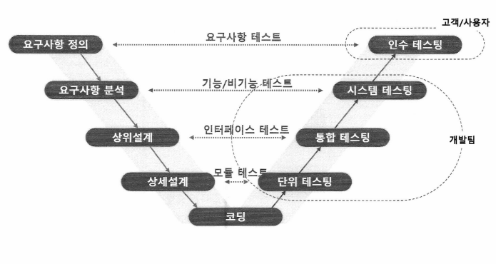
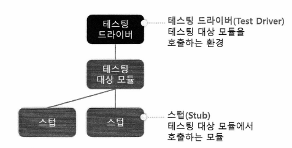
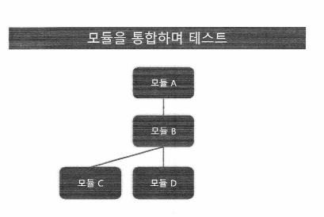

## 테스트의 목적

프로그램이 사용할 만한 것인지 확인하기 위하여 **결함을 발견**할 목적으로 프로그램을 실행하는 작업

- ### 완벽한 테스트는 불가능
    - 한 프로그램 내의 조건은 무수히 많다
    - 입력에 가질 수 있는 모든 값의 조합이 무수히 많다
    - GUI 이벤트가 발생하는 순서에 대한 조합도 무수히 많다

- ### 결함이 없음을 보이려는 것이 아님

- ### 현실적인 테스트의 목적
    - 주어진 시간과 인력으로 오류를 발견할 확률이 높은, 가장 효율적인 테스트 케이스를 찾아내고 실행하는 일

## 테스팅 vs 디버깅

|    | 테스팅                                   | 디버깅                        |
|--------|------------------------------------------|--------------------------------|
| 목적   | 알려지지 않은 결함을 발견                | 알려져 있는 결함을 수정   |
| 수행   | 테스터, QA 등 외부의 제3자, 개발자       | 개발자                        |
| 주요 작업 | 숨겨진 결함을 발견                        | 결함의 정확한 위치 파악, 결함의 타입 식별, 결함 수정 |

## 소프트웨어 품질 향상을 위한 테스트 순서
**테스팅** (*결함의 발견*) &rarr; **디버깅** (*결함 수정*) &rarr; **재테스팅** (*결함 해결 확인*) 

## 재테스팅(Re-Testing)
- 목적: 발견된 결함이 정상적으로 조치되었는지 확인하는 행위
- 수행: 결함 발견자 (테스팅 담당자)
- 수행 시기: 담당 개발자가 결함이 조치되었다고 전달할 때

## 회귀 테스트 (Regression Test) 
- ### 정의
    - 정상 동작하던 기능이 SW 수정 후 문제가 발생하는 회귀 결함의 유무를 확인하기 위하여 이전 테스트 케이스를 다시 실행하며 확인하는 테스트
    - SW 수정으로 인한 부정적인 영향 유무를 확인하기 위한 테스트
- ### 회귀 결함을 발생시키는 SW 수정의 종류
    - 새로운 결함의 조치
    - 리팩토링
    - 기능 추가/변경
- ### 수행 방법
    - **자동화된 테스트 수행을 권고**
        - 자동화된 이전 테스트 케이스(스크립트)의 실행
        - 수동 테스트로 진행하기엔 비용/인력/시간에 대한 제약
    - **주기적인 회귀 테스트 수행**
        - 신규 Commit 시 수행 : 프로젝트 크기가 작은 경우
        - 일/주 단위 수행 : 프로젝트 크기가 큰 경우
## 동적테스트 4단계
단위테스트 &rarr; 통합테스트 &rarr; 시스템테스트 &rarr; 인수테스트

## 단위 테스트 (Unit Test) / 컴포넌트 테스트 (Component Test)
- **정의** : 설계된 모듈이 정확히 구현되었는지 확인하고, 모듈과 같은 하나의 소프트웨어 구성요소나 소프트웨어 구성요소의 집합이 프로그램의 요구사항에 맞는지 확인하는 테스트  
- **목적** : 모듈이 올바르게 코딩되었는지 확인
- **수행주체** : 개발자
- **테스트 대상** : 모듈 수행기능(블랙박스), 코드 내부표현(화이트박스), 경계조건
- **완료시점** : 개발자가 더 이상의 오류가 없다고 판단될 때

## 단위 테스트 한정 결함 원인
- 단위 테스트에서 결함이 발생한다면, 그 원인은 테스트 대상 모듈에 한정해야 함

<테스팅 할 모듈을 단독적으로 실행할 수 있는 환경 필요> 

## 통합 테스트 (Integration Test)
- **정의** : 시스템의 설계와 요구사항이 부합하는지 보이기 위해 소프트웨어 구성요소, 하드웨어 구성요소 등이 점차 통합되어 전체 시스템으로 통합될 때 까지 이루어지는 절차적인 테스팅 

### SW 통합 전략
- **빅뱅(Big Bang) 기법**
  - 모듈을 한꺼번에 통합하여 테스팅을 하는 방법
  - 오류가 발생하였을 경우 어느 부분에서 오류가 발생했는지 찾기 힘들다

- **상향식(Bottom-Up) 기법**
  - 하위 모듈부터 테스팅 하고 상위 모듈로 점진적으로 통합하는 방법
  - 하위 모듈 테스팅

- **하향식(Top-Down) 기법**
  - 가장 상위 모듈부터 하위 모듈로 점진적으로 통합하는 방법
  - 상위 모듈 테스팅 시, 하위 모듈에 대한 스텁이 필요

## [참고] CI/CD (Continuous Integration/Continuous Deployment)
    CI/CD는 소프트웨어 개발 및 배포 프로세스를 자동화하여 코드의 변경 사항을 효율적으로 통합하고 배포하는 방법론
        -> SW 통합 오류를 개발 초기부터 예방하는 것 (품질과 안정성 조기 확보)
- **지속적 통합 (CI, Continuous Integration)**
   - **설명**: 개발자가 변경한 코드를 주기적으로 통합하고, 자동화된 테스트를 통해 코드의 안정성을 확인하는 과정
   - **목표**: 코드 변경 사항이 주기적으로 통합되어 지속적으로 빌드와 테스트가 이루어짐으로써, 코드 품질을 유지하고 문제를 조기에 발견하여 수정

-  **지속적 배포 (CD, Continuous Deployment)**
   - **설명**: CI 과정 이후, 자동으로 애플리케이션을 배포하는 과정
   - **목표**: 자동화된 배포 파이프라인을 통해 새로운 기능이나 수정 사항을 빠르고 안정적으로 사용자에게 제공

## 시스템 테스팅 (System Testing)
- ### 정의
    - 모듈이 모두 통합된 후, 사용자의 요구사항이 만족되었는지 검사하는 테스팅
    - 고객에게 시스템을 전달하기 전, 시스템을 개발한 조직이 주체가 되는 마지막 테스팅
- ### 테스팅 대상
    - 요구사항 명세서를 기초로 하여 사용자의 기능 요구사항
    - 보안, 성능, 신뢰성, UX 등의 비 기능 요구사항
    - 기능 안전 요구사항
- ### 테스트 형상 고정
    - 시스템 테스팅의 재테스트 대상은 **"전체 테스트 케이스"**
    - 한 테스트 Cycle이 수행되는 동안에는 테스트 형상의 고정이 필요  **->** 결함을 발견해도 수정만 하고 배포 하지 않음

## 인수 테스팅 (Acceptance Testing)
- ### 정의
    - 시스템이 사용자에게 인수되기 전, 사용자에 의해 실시되는 테스팅
    - 실제 사용자가 운영하는 환경에서 실시
    - 인수 테스팅을 통과해야만 시스템이 정상적으로 사용자에게 인수되고 프로젝트는 종료됨
- 완성차 업체(OEM)에서 가장 많이 신경쓰는 테스트

