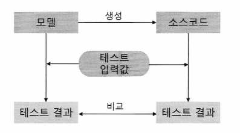

# 테스팅 설계

## 효과적/효율적("Effective" & "Efficient") 테스팅
- ### 효과적 (Effective)
    - 계획했거나 원했던 테스트 결과를 도출
    - 테스팅 노력으로부터 어떤 결과를 도출할 것인지 결정
- ### 효율적 (Efficient)
    - 원했던 테스트 결과를 생산적(효율적으로)으로 도출
    - 가용한 리소스(시간, 자금, 인력)를 적절하고 현명하게 배치

### 블랙박스/명세기반 테스트
- 소스 코드 자체의 로직(Logic)은 제외하고, 출력 값에만 초점을 두고 테스트하는 방법
- 요구사항 명세서(SRS)나 설계서로부터 테스트 케이스 추출
  - 기능 테스트 : 모듈의 외부(입력, 출력)

    | ID  | 테스트 케이스                          |
    |-----|----------------------------------------|
    | 1   | A가 가장 큰 정수일 경우...              |
    | 2   | B가 가장 큰 정수일 경우...              |
    | 3   | C가 가장 큰 정수일 경우...              |
    | 4   | A를 음수로 입력할 경우...               |
    | 5   | A와 B를 같은 정수로 입력할 경우...       |
    | 6   | B를 소수로 입력할 경우...               |
    | 7   | ...                                    |

### 화이트박스/구조기반 테스트
- 소스코드 내의 모든 독립적인 경로를 수행하여 봄으로써 잠재적인 오류를 찾아내는 방법
- 내부구조(소스 코드)를 기반으로 테스트 케이스 추출
  - 구조 테스트 : 모듈의 내부(로직)
    | ID  | 테스트 케이스                  |
    |-----|--------------------------------|
    | 1   | (1 -> 2 -> 3 -> 5 -> 6 -> 8)  |
    | 2   | (1 -> 2 -> 3 -> 5 -> 7 -> 8)  |
    | 3   | (1 -> 2 -> 4 -> 5 -> 6 -> 8)  |
    | 4   | (1 -> 2 -> 4 -> 5 -> 7 -> 8)  |

    

# 명세기반 테스트 (Specification-based Testing)

## 인터페이스 테스트
- **인터페이스에 오류가 없음을 검증하기 위함 테스트**

- **단위 테스트 수준에서 모듈에 대한 입력의 올바른 처리 여부 검증**
  - 유효 입력값/비유효 입력값
  - 테스트 드라이버와 스텁 필요

- **통합 테스트 수준에서 다른 모듈과의 연계를 위한 출력 검증**

- **테스트 절차**
  - 테스트 대상 인터페이스 식별
  - 인터페이스 입력값 생성
  - 테스트 결과 확인
## 백투백 (Back-to-Back) 테스트
- **두 개 이상의 테스트 대상 시스템에 동일한 입력값으로 실행하여 결과를 비교 분석하는 테스트 기법**
- 주 사용 예시
  - SW 모델과 소스코드
  - 시뮬레이터와 실제 타겟 보드
 

## 결함 주입 (Fault Injection)
- **메커니즘이 올바로 동작하는지 확인하기 위해 임의의 결함을 주입하는 테스트**
- **인위적인 결함을 발생시켜 예외 상황에서의 시스템 동작을 확인하기 위함**

- 결함 주입의 2가지 방법
  - 컴파일시 결함 주입 : 변수 값, 소스코드 변경
  - 런타임시 결함 주입 : CPU 레지스터, 메모리 값 변경

- ### 결함 주입 테스트 시 고려 사항
    - 결함 주입을 위해 부적절한 모듈 입력, 시스템 설정 변경 등을 생성하기 위해 시스템이나 모듈에 대한 수정이 필요할 수 있음 -> 회귀결함을 발생 시킬 수 있음

    - 안전 메커니즘이 적절하게 동작하지 않는 경우 다른 모듈로 오류가 전파될 수 있음

    - 많은 노력이 필요한 테스트이므로 안전 무결성 등급이 높은 부분에 집중할 필요가 있음

## 구문 테스팅 (Syntax Testing)

- 블랙박스 테스팅 기법 중 가장 단순한 방법  
- 입력 데이터가 미리 정의된 데이터 유형에 적합한지를 검증하는 방법  
- 입력 값을 적합(valid)과 부적합(invalid)으로 분류한 뒤, 예상되는 결과를 검증하는 기법

    ### 예시 : 회원 가입 폼에서 사용자 이름이나 아이디의 데이터 유형이 적합한지를 확인하는 경우

    | 입력 변수 | 적합 조건                  | 부적합 조건           |
    |-----------|----------------------------|------------------------|
    | 사용자 이름 | 6자리 이상 8자리 이하 알파벳 | 숫자, 특수 기호 등 |

    | No | 적합/부적합 | 입력 유형   | 입력 값 | 예상 결과                           |
    |----|-------------|-------------|---------|--------------------------------------|
    | 1  | 적합       | 7자리 알파벳 | kildong | 정상 처리                            |
    | 2  | 부적합     | 길이가 짧은 경우 | kil     | 에러 메시지 - 길이 부족              |
    | 3  | 부적합     | 알파벳이 아닌 경우 | 김동586 | 에러 메시지 - 입력 유형 부적합        |

## 동등분할 (Equivalence Partitioning)
- 같은 결과값을 출력하는 입력값의 모음
- 입력값이 범위가 정해져 있을 경우, 각 범위의 대표값(평균값, 중앙값, 최빈값 등등)을 이용하여 테스팅
- 동치 클래스라고도 함
- 입력값의 범위 또는 분류를 정의한다는 것에 의미가 있음

- ### 적용 방법
    - 테스트 베이시스를 이용해 입력과 출력을 유사한 특징을 가지는 범위로 분류
    - 각 범위를 대표하는 입력/출력 값을 선정하여 테스트 케이스로 식별
    - 모든 유효 범위를 테스트하고, 필요 시 비유효 범위 포함하여 케이스 생성
## 경계값 분석 (Boundary Value Analysis)
입력 값의 주요 오류 대상인 **경계값**을 입력값으로 테스트 케이스를 작성하여 테스팅
- ### 경계값 설정 기준
    - **입력(출력) 조건이 [a, b]와 같이 값의 범위를 명시하고 있을 경우**
        - a와 b 값 뿐만 아니라 [a, b] 범위를 약간씩 벗어나는 값들을 테스트 케이스로 선정

    - **입력(출력) 조건이 특정한 수를 나타낼 경우**
        - 그 수가 가질 수 있는 최대값, 최소값과 최대값보다 약간 큰 값, 최소값보다 약간 작은 값을 테스트 케이스로 선정
        
    - **프로그램의 입력력이 배열, 순서 파일 또는 리스트와 같이 순서 집합일 경우**
        - 시작과 마지막 요소를 중심으로 테스트 케이스를 생성

  
# 구조기반 테스트 (Structure-based Testing)

## **다중 조건 커버리지 (Multiple Condition Coverage)**
  - 프로그램 내의 조건이 여러 개 있을 때, 각각의 조건이 가질 수 있는 모든 조합에 대해 테스트를 수행하는 커버리지.
  - 예를 들어, 조건이 A, B, C 세 개라면, 각 조건이 참/거짓이 될 수 있는 모든 경우의 수(2^3 = 8가지)를 테스트해야 함.
  - 모든 가능한 조건의 조합을 테스트하므로 테스트의 범위가 매우 넓어짐. 하지만 이를 통해 모든 조건의 상호작용을 충분히 확인할 수 있음.

## **변경 조건/결정 커버리지 (MC/DC, Modified Condition/Decision Coverage)**
  - 조건들이 결정에 미치는 영향을 독립적으로 테스트하는 커버리지.
  - 각 조건이 다른 조건에 의존하지 않고, 해당 결정에 영향을 미치는지 여부를 확인함.
  - 주로 항공, 자동차 등 안전이 중요한 소프트웨어에서 사용됨. 안전-critical 시스템에서 많이 요구되는 기준임.
  - 모든 조건이 결정에 독립적으로 영향을 미친다는 것을 증명해야 하기 때문에 조건 조합에 대한 검증이 중요.

## **조건/결정 커버리지 (Condition/Decision Coverage)**
  - 각 조건과 결정이 프로그램의 흐름에 영향을 미치는지를 테스트하는 커버리지.
  - 모든 조건의 참/거짓 상태를 테스트하며, 결정문(if, while 등)에서 결정이 참 또는 거짓으로 평가되는지 확인함.
  - 조건/결정 커버리지는 조건이 참/거짓으로 각각 평가되었는지, 결정문이 양쪽으로 분기되었는지 확인할 수 있음.

## **결정 커버리지 (Decision Coverage)**
  - 프로그램 내에서 결정문이 참/거짓으로 평가되어 분기되었는지를 확인하는 커버리지.
  - 결정문에 대한 모든 가능성을 테스트하여 해당 결정이 실행될 때 발생할 수 있는 모든 경로를 탐색하는 것이 목적.
  - if, switch, while 등의 제어 구조를 포함하며, 각 분기문이 참 또는 거짓으로 평가되었는지를 보장함.

## **조건 커버리지 (Condition Coverage)**
  - 결정문 내에서 각각의 조건이 참/거짓으로 한 번 이상 평가되었는지 확인하는 커버리지.
  - 복합적인 결정문을 가진 경우에도 모든 개별 조건이 참과 거짓으로 평가되었는지를 테스트함.
  - 조건 커버리지는 개별 조건의 상태 변화를 모두 테스트하는 것이 목표임.

## **구문 커버리지 (Statement Coverage)**
  - 프로그램의 모든 구문(Statement)이 최소 한 번은 실행되었는지를 확인하는 커버리지.
  - 코드에 존재하는 각 명령문이 실행되었는지 확인하는 가장 기본적인 커버리지로, 프로그램의 실행 흐름 전체를 테스트함.
  - 구문 커버리지는 소스 코드의 각 구문이 적어도 한 번은 실행되도록 하여, 코드 내 숨겨진 오류를 최소화할 수 있음.

## **함수 커버리지 (Function Coverage)**
  - 소프트웨어 내에 정의된 모든 함수가 최소 한 번 이상 호출되었는지를 확인하는 커버리지.
  - 함수 커버리지는 프로그램에서 모든 함수가 실제로 실행되는지 보장함으로써 테스트 범위를 넓힐 수 있음.
  - 주로 함수 호출이 제대로 이루어졌는지 확인하는 데 중점을 둔 기법임.

## **경로 커버리지 (Basis Path Coverage)**
  - 프로그램 내의 모든 독립적인 경로를 탐색하여 테스트하는 기법.
  - 제어 흐름 그래프를 기반으로 경로를 정의하며, 가능한 모든 실행 경로가 한 번 이상 테스트되는지 확인함.
  - 모든 경로가 다르게 동작하는지 확인하기 위해 각 경로에 대한 테스트 케이스를 작성해야 하므로 테스트 범위가 매우 넓음.