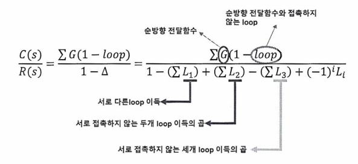

# 제어 시스템의 분류

### 목표값에 따른 분류
- **정치 제어 (Constant Control)**: 목표값이 시간적으로 변화하지 않고 일정한 제어
- **추치 제어 (Follow-up Control)**: 목표값이 시간적으로 변화하는 경우의 제어
  - **추종제어 (Tracking Control)**: 대공포, 추적 레이더, 유도 미사일 (random)
  - **프로그램 제어 (Programmed Control)**: 무인열차, 엘리베이터 (예측 가능)
  - **비율 제어 (Ratio Control)**: 보일러, 배터리

### 제어량 성질에 의한 분류
- **서보기구 (Servo-mechanism)**: 위치, 방위, 자세, 거리, 각도
- **프로세스 제어 (Process Control)**: 밀도, 농도, 온도, 압력, 유량, 습도 (공정)
- **자동 조정 기구 (Automatic Regulating Device)**: 속도, 전위, 전류, 힘, 주파수 (전기/기계)

### 조절부의 제어 동작에 의한 분류
- **불연속 제어 (Discrete Control)**: ON-OFF 제어
- **연속 제어 (Continuous Control)**:
  - **비례 제어 (P, Proportional Control)**: 잔류편차 발생
  - **적분 제어 (I, Integral Control)**: 잔류 편차 제거
  - **미분 제어 (D, Derivative Control)**: 오차가 커지는 것을 방지
  - **비례 적분 제어 (PI, Proportional-Integral Control)**: 잔류 편차 제거, 속응성이 길다
  - **비례 미분 제어 (PD, Proportional-Derivative Control)**: 응답 속응성 향상, 잔류편차 존재
  - **비례 적분 미분 제어 (PID, Proportional-Integral-Derivative Control)**: 응답 속응성의 개선, 잔류 편차 제거, 안정도가 좋음

   
# 라플라스 변환이 제어공학에서 필요한 이유
### 선형 시스템 해석의 용이성
- 제어 시스템에서 주로 다루는 선형미분방정식은 시간 영역에서 다루기 어려울 수 있음. 라플라스 변환을 사용하면 이러한 **미분방정식**을 **대수방정식**으로 변환할 수 있어, 해석 및 해를 간단히 구할 수 있음.

### 시간 영역에서의 복잡한 계산을 주파수 영역에서 간단히
- 라플라스 변환을 통해 시스템의 입력과 출력을 시간 영역 대신 **주파수 영역**에서 다룰 수 있음. 이는 시스템의 안정성, 응답특성, 전달함수를 분석할 때 매우 유용함.

### 전달함수 계산
- 시스템의 **전달함수**를 쉽게 구할 수 있음. 전달 함수는 시스템의 입력과 출력 사이의 관계를 나타내며, **주파수 영역**에서 시스템의 특성을 분석하는 데 사용.

### 안정성 및 성능 분석
- 제어 시스템의 안정성 및 성능을 분석할 때 라플라스 변환을 통해 시스템의 극점(poles)과 영점(zeros)을 파악할 수 있음. 이 정보는 시스템의 동작 및 안정성을 결정하는 데 중요한 역할을 함.
   
# 라플라스 변환 VS 푸리에 변환

## 라플라스 변환 (Laplace Transform)
라플라스 변환은 시간 영역에서 주파수 영역으로 변환하는 기법으로, 주로 제어 시스템의 안정성과 동작 특성을 분석하는 데 사용됩니다.

- **정의**: 시간에 대한 함수의 변화를 주파수 영역으로 변환하여 시스템의 동작을 쉽게 분석할 수 있도록 해주는 도구입니다.
- **특징**: 시스템의 미분 방정식을 대수 방정식으로 변환하여 복잡한 문제를 간단하게 풀 수 있게 합니다. 이는 제어기 설계와 시스템의 안정성 분석에 유용합니다.
- **활용**: 주로 시스템의 안정성 평가, 전달 함수 계산 등 제어 시스템의 특성 분석에 사용됩니다. 시스템이 시간에 따라 어떻게 변화하는지 파악하는 데 효과적입니다.

## 푸리에 변환 (Fourier Transform)
푸리에 변환은 신호를 시간 영역에서 주파수 영역으로 변환하여 각 주파수 성분을 분석하는 기법입니다.

- **정의**: 주어진 신호를 다양한 주파수 성분으로 분해하여 주파수 영역에서의 특성을 이해하는 데 사용하는 방법입니다.
- **특징**: 시간에 따른 신호를 여러 주파수 성분으로 분해함으로써, 특정 주파수에서의 신호의 크기와 위상을 알 수 있습니다. **감쇠 성분**이 없는 순수한 진동 신호를 다룹니다.
- **활용**: 주로 신호 처리 분야에서 사용되며, 특정 주파수의 성분을 분석하거나 필터링할 때 유용합니다. 오디오 신호, 전자기파 분석 등에 많이 활용됩니다.

## 라플라스 변환 vs 푸리에 변환

#### **라플라스 변환**
    시스템 분석에 중점을 두며, 시스템의 안정성이나 제어기 설계 시 사용된다. 복소수 영역을 이용하여 시스템의 동적 특성을 포괄적으로 평가한다.
#### **푸리에 변환**
    신호 분석에 적합하며, 신호의 주파수 구성 요소를 파악하는 데 사용된다. 주파수 성분을 분해하여 신호의 특성을 이해하는 데 중점을 둔다.

#### **차이점**
     라플라스 변환은 감쇠(σ) 성분을 포함하여 시스템의 과도 상태까지 분석할 수 있는 반면, 푸리에 변환은 순수한 주기적인 신호를 분석하는 데 초점을 맞추고 있습니다.
  

# 블록선도 (Block Diagram)

## 정의
블록선도는 시스템의 구성 요소들을 블록 형태로 표현하여, 각 구성 요소 간의 관계와 데이터 흐름을 시각적으로 나타내는 다이어그램입니다. 제어 시스템에서 시스템의 구조와 기능을 이해하는 데 사용됩니다.

## 특징
- **시각화**: 복잡한 시스템을 여러 개의 블록으로 나누어 구성 요소 간의 관계를 쉽게 이해할 수 있도록 함. 각 블록은 시스템의 특정 기능을 수행하며, 화살표는 입력과 출력을 나타냅니다.
- **계층적 구조**: 시스템을 계층적으로 나타낼 수 있어, 전체 시스템뿐만 아니라 부분 시스템의 동작까지 명확히 파악할 수 있음.
- **모듈화**: 시스템을 모듈화하여 각 모듈의 역할을 분명히 함으로써, 시스템 설계 및 분석이 용이해짐.

## 구성 요소
1. **블록 (Block)**: 시스템의 특정 부분을 나타내며, 입력 신호를 받아 처리한 후 출력 신호를 생성하는 기능을 수행합니다.
2. **입력과 출력 (Input and Output)**: 블록에 들어가는 신호와 나오는 신호로, 시스템의 흐름을 결정합니다.
3. **전달 함수 (Transfer Function)**: 각 블록은 수학적 모델로 나타낼 수 있으며, 전달 함수는 블록이 입력 신호를 어떻게 변환하는지를 나타냅니다.
4. **연결선 (Arrow/Line)**: 블록 간의 신호 흐름을 나타내며, 시스템의 입력에서 출력까지의 관계를 보여줍니다.
5. **합산점 (Summing Point)**: 여러 신호를 더하거나 뺄 때 사용되는 노드로, 각 신호의 가중치를 포함하여 결합합니다.
6. **분기점 (Branch Point)**: 신호가 여러 경로로 분기되는 지점을 나타냅니다.

## 사용 목적
- **시스템 분석**: 시스템의 구성 요소 간의 관계를 쉽게 분석할 수 있어, 시스템의 동작을 명확히 이해하고 최적화하는 데 유용함.
- **제어기 설계**: 제어 시스템의 입력과 출력을 시각적으로 표현하여 제어기 설계 시, 시스템의 동작 방식을 이해하는 데 도움을 줌.
- **전달 함수 도출**: 블록선도를 사용하여 시스템의 전달 함수를 쉽게 도출할 수 있으며, 이를 통해 시스템의 성능을 분석하고 제어기를 설계할 수 있음.

## 장점
- **직관성**: 시스템의 동작 방식을 직관적으로 표현하여 설계자와 분석자가 쉽게 이해할 수 있음.
- **모듈화**: 시스템을 모듈 단위로 나누어 표현함으로써, 각 모듈의 기능과 역할을 명확히 구분할 수 있음.
- **변경 용이성**: 시스템의 일부분을 변경하거나 개선할 때, 해당 부분만 수정하여 전체 시스템을 다시 분석할 수 있어 효율적임.
  
## Feed-Back Loop (등가 회로)

### F(s) = 1 ± G(s)H(s)은 시스템의 특성방정식

# 신호 흐름도 (Signal Flow Graph)

## 정의
시스템의 변수를 노드로, 변수 간의 관계를 화살표로 나타내어 시스템의 동작을 시각적으로 표현하는 그래프로 블록선도와 유사하지만, 신호 흐름도는 주로 신호 처리나 제어 시스템에서 변수 간의 관계를 직관적으로 표현하는 데 사용된다.

## 사용 목적
- **시스템 표현**: 시스템의 입력, 출력, 내부 변수 간의 관계를 시각적으로 표현하여 복잡한 시스템을 쉽게 이해하고 분석할 수 있도록 합니다.
- **신호 흐름 추적**: 특정 변수에서 다른 변수로의 신호 흐름을 쉽게 파악할 수 있어, 시스템의 전체적인 동작을 파악하는 데 유용합니다.
  
# 메이슨의 공식 (Mason's Gain Formula)

## 정의
메이슨의 공식은 신호 흐름도를 이용하여 시스템의 전달 함수를 빠르게 계산할 수 있는 방법입니다. 모든 경로와 루프를 고려하여 시스템의 입력에서 출력으로의 이득을 계산합니다.

## 메이슨의 공식 (Mason's rule)
- 시스템의 출력에서 입력으로의 총 이득을 구하기 위해 다음을 계산한다.
  

## 메이슨의 공식 적용 방법
1. **전향 경로 식별**: 입력에서 출력까지의 모든 전향 경로를 찾습니다.
2. **루프 식별**: 시스템 내 모든 독립된 루프를 식별합니다.
3. **루프 이득 계산**: 각 루프의 이득을 계산하고, 서로 영향을 미치지 않는 독립 루프를 조합하여 특성식을 구합니다.
4. **총 이득 계산**: 메이슨의 공식에 대입하여 전체 전달 함수를 계산합니다.

## 장점
- **복잡한 시스템의 간편한 해석**: 메이슨의 공식은 신호 흐름도를 사용하여 복잡한 시스템의 전달 함수를 간단하게 계산할 수 있어 제어 시스템 해석에 유용합니다.
- **비정상 루프 처리**: 다수의 피드백 루프가 있는 시스템에서도 효과적으로 사용될 수 있습니다.
   

# MDS 시스템 (Mass-Damper-Spring 시스템)

MDS 시스템은 질량(Mass), 댐퍼(Damper), 스프링(Spring)으로 구성된 기계적 진동 시스템으로, 주로 진동을 제어하고 시스템의 동적 응답을 개선하기 위해 사용됩니다.

#### 1. MDS 시스템의 구성 요소
- **질량 (Mass)**: 외력에 의해 움직이는 부분으로, 시스템에서 진동의 원인이 될 수 있는 물체.
- **댐퍼 (Damper)**: 진동을 감쇠하기 위해 에너지를 소모하는 장치로, 마찰력이나 점성 저항을 통해 진동 에너지를 소산.
- **스프링 (Spring)**: 외부 힘에 대한 복원력을 제공하며, 변형 후 원래 상태로 되돌아가려는 탄성 요소.

#### 2. MDS 시스템의 원리
MDS 시스템은 질량, 댐퍼, 스프링이 병렬로 연결된 형태로 진동을 제어합니다. 외력이 작용할 때 스프링과 댐퍼는 복원력과 저항력을 제공하여 진동의 동적 응답을 조절합니다.

#### 3. MDS 시스템의 응용
- **건축 구조물**: 고층 빌딩이나 교량에서 바람이나 지진에 의한 진동을 제어. 예: 대형 질량 댐퍼(Tuned Mass Damper, TMD).
- **자동차 서스펜션 시스템**: 차량의 승차감과 안정성을 개선하기 위해 사용.
- **기계 장치**: 공작 기계나 회전 기계에서 진동을 줄여 정밀성을 높이고 기계적 손상 방지.

#### 4. 시스템 특성
- **자연 진동수 (Natural Frequency)**: 외부 힘 없이 시스템이 자유롭게 진동할 때의 고유한 주파수.
- **감쇠비 (Damping Ratio)**: 시스템의 감쇠 정도를 나타내며, 과도 응답의 형태를 결정.
  - 감쇠비 > 1: 과감쇠 (Overdamped)
  - 감쇠비 < 1: 부족 감쇠 (Underdamped)
  - 감쇠비 = 1: 임계 감쇠 (Critically Damped)

#### 5. MDS 시스템의 동적 응답
- **자유 진동 (Free Vibration)**: 외부의 강제력 없이 초기 조건에 의해 발생하는 진동.
- **강제 진동 (Forced Vibration)**: 외부에서 주기적인 힘이 작용할 때 발생하는 진동. 공진 발생 시 진폭이 급격히 증가할 수 있음.

#### 종합 정리
MDS(질량-댐퍼-스프링) 시스템은 진동 제어를 위한 기본적인 기계적 시스템으로, 질량, 댐퍼, 스프링의 조합을 통해 진동을 효율적으로 감쇠시키고 제어할 수 있습니다. 건축, 기계, 자동차 등 다양한 분야에서 사용되며, 자연 진동수와 감쇠 특성에 따라 설계와 제어 방법이 달라질 수 있습니다. 이를 통해 시스템의 안정성, 승차감, 정밀성을 크게 향상시킬 수 있습니다.
