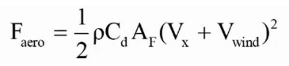
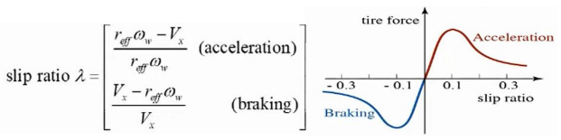
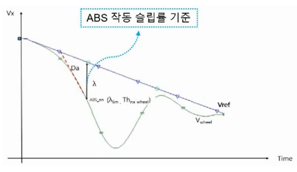

# 차량 동역학
### - CG(Center of Gravity) : 차량의 무게 중심
### - 차량의 직선운동
    x 축 : 차량의 직진방향을 의미(Longitudinal motion) / 주행, 제동
    y 축 : 차량의 횡방향을 의미(Lateral motion) / 선회성능
    z 축 : 차량의 상하방향을 의미(Vertical motion) / 승차감

### - 차량의 회전운동
    x 축 회전 : Roll
    y 축 회전 : Pitch
    z 축 회전 : Yaw

### - 자동차 = Body + Chassis
    ▪ Body : 차량의 외관 등
    ▪ Chassis(샤시) : 동력전달장치, 동력발생장치, 현가장치, 조향장치, 제동장치 등

### - 차량의 운동 성능
    ▪ 가속 성능 : 차량이 얼마나 빠르게 가속할 수 있는지를 의미하며, 엔진 출력, 구동력 전달 시스템, 공기 저항, 무게 중심 등이 영향을 미침
    ▪ 제동 성능 : 차량이 얼마나 효율적으로 감속하고 정지할 수 있는지 의미. 제동 시스템 설계, 타이어 접지력, 무게 중심 등이 주요 요소
    ▪ 조향 성능 : 차량의 조향 반응 속도와 정확도를 의미하며, 조향각, 휠베이스, 서스펜션 설정 등이 주요 요소로 작용

### - 타이어 특성
    ▪ 접지력 : 타이어와 노면 사이의 마찰을 통해 차량이 움직일 수 있는 힘 제공
    ▪ 슬립 각(Slip Angle) : 타이어의 진행 방향과 실제 진행 방향 사이의 각도. 코너링 시 발생하며 횡방향 힘과 밀접한 관련이 있음

### - 차량의 안정성
    ▪ 언더스티어(Understeer) : 코너링 시 차량의 앞바퀴가 접지력을 잃어 차량이 예상 경로보다 바깥쪽으로 나가는 현상
    ▪ 오버스티어(Oversteer) : 코너링 시 차량의 뒷바퀴가 접지력을 잃어 차량의 뒷부분이 예상 경로보다 더 회전하는 현상

###  UnderSteer/Oversteer에서 필요한 차량 모션 제어?
    차량에 추가 yaw motion이 발생하도록 제어 필요
    Sensor로 yaw 양을 측정하여 원하는 yaw motion값이 되도록 브레이크 제어

## Longitudinal Dynamics(종방향 거동)

- 차량이 가는 방향을 x방향으로 정의하여 차량의 거동을 묘사
- 차량의 대표적인 Longitudinal Control
  - (Adaptive) Cruise Control(ACC)
  - Anti-Lock Braking System(ABS)
  - Traction Control System(TCS)
- 종방향 움직임을 만들어내는 힘 평형 관계 
  - **Force 변수**
    - 𝑭𝒂𝒆𝒓𝒐 : Aerodynamics drag force
    - 𝑭𝒙𝒇/𝒙𝒓 : Longitudinal tire force
    - 𝑹𝒙𝒇/𝒙𝒓 : Rolling Resistance(구름 저항)
  - **기타 변수**
    - m : 차량 질량
    - 𝜽 : 도로 경사도

### - 종방향에 운동에 작용하는 힘
  - **Aerodynamics drag force**
    - 공기에 의한 저항력: 속도 제곱에 비례
    

    - **변수 설명**:
      - \( C_d \): 공기 역학 계수 (aerodynamic drag coefficient)
      - \( A_F \): 차량의 정면 면적 (차량을 앞에서 봤을 때의 Projected 면적, 차량 가로세로의 약 79% ~ 84%)
      - \( \rho \): 공기 밀도 (\( \approx 1.225 \, \text{kg/m}^3 \))
      - \( V_x \): 차량 종방향 속도
      - \( V_{wind} \): 바람 속도 (+부호: headwind, 맞바람)

  - **특징**:
    - Aerodynamics drag force는 에너지 효율에 큰 영향을 미치며, 특히 고속에서는 매우 좋지 않은 영향을 줌.
    - 차량 디자인에 따라 바꿀 수 있는 부분은 공기역학계수와 Vehicle frontal area뿐.

### - Longitudinal Tire Force (종방향 타이어의 힘)
  - 타이어와 노면 사이에 작용하는 일종의 마찰력
  - **타이어 Traction Force(견인력)**:
    - 차량으로서의 동력 전달을 위해 타이어가 낼 수 있는 최대 힘
    - 엔진 출력이 매우 좋더라도 타이어 traction force가 낮으면 동력 전달이 제대로 안 되어 공회전 발생
    - 타이어의 traction force, 즉 종방향 타이어 힘 특성은 휠 슬립률, 타이어-노면 마찰계수, 타이어 수직하중 등에 영향을 받음
  - **종방향 타이어 힘에 영향을 주는 요인**:
    - Slip Ratio(슬립 률)
    - **TCS**(Traction Control System)와 **ABS**(Anti-lock Braking System)와 연관 있음
    
    
## - Anti-lock Braking System (ABS)
  - **Sensor**: 각 바퀴의 휠 속도를 실시간으로 감지하여 차량의 제동 상태를 모니터링함
    - 각 휠에 장착된 속도 센서를 통해 휠의 회전 속도를 측정
  - **Actuator**: 브레이크 유압을 제어하여 휠이 잠기는 것을 방지함
    - 휠이 잠기지 않도록 유압을 조절해 주는 밸브와 펌프를 포함
  - **제어 목적**: 최적의 제동력을 내기 위해 최적의 슬립률 유지
    - 휠이 완전히 잠겨서 미끄러지는 현상을 방지하고, 제동 중에도 조향성을 유지
    - 급제동 시에도 휠이 계속 회전하게 하여 차량이 미끄러지지 않고 안정적인 제동을 제공
  - **작동 과정**:
    1. **센서**가 각 휠의 속도를 측정하고 제동 중 휠이 잠기려고 하면 이를 감지
    2. **전자제어장치(ECU)**가 휠이 잠길 위험을 판단하고, **액추에이터**를 통해 유압을 줄여 휠이 계속 회전하도록 조정
    3. 이 과정을 빠르게 반복하여 제동력과 조향성을 최적화함
  - **장점**:
    - 제동 시 **조향 가능성** 유지: 급제동 중에도 핸들 조작을 통해 장애물을 피할 수 있음
    - **제동 거리 단축**: 일반 도로 조건에서 미끄러지지 않도록 제동력을 최적화하여 제동 거리를 줄임
  - **한계**:
    - ABS는 빙판길과 같은 낮은 마찰 계수의 노면에서는 제동 거리가 길어질 수 있음
    - ABS의 개입으로 제동력이 반복적으로 조절되므로 운전자에게 떨림이 느껴질 수 있음

## - Cruise Control (CC)
  - **정의**: 운전자가 페달을 밟지 않아도 설정한 속도를 유지하는 종방향 제어 기능
  - **Sensor**: 차량 속도를 감지하는 **Speed Sensor**
  - **Actuator**: **Throttle** 제어 (브레이크는 사용하지 않음)
  - **Cruise Control 사용법**:
    - 크루즈 기능 **ON** 후 목표 속도 설정
    - **Throttle angle**로 속도 조절 (엑셀 페달을 대신하여 스로틀 밸브 개방 각도를 조절)
    - 브레이크를 밟으면 **CC 모드 OFF** 되어 수동 제어로 전환됨
  - **특징**:
    - 장거리 주행 시 운전자의 피로를 줄여줌
    - 속도 유지로 인한 연비 개선 가능
  - **제한 사항**:
    - 도로 상황에 따라 수동 제어로의 전환이 필요하며, 교통이 복잡한 구간에서는 사용을 피하는 것이 좋음

## - Adaptive Cruise Control (ACC)
  - **정의**: 운전자가 페달을 밟지 않아도 설정한 속도 또는 앞차와의 간격을 유지하는 종방향 제어 기능
  - **Sensor**:
    - **Radar**: 앞차와의 거리 및 상대 속도를 감지
    - **Camera**: 차선 및 차량 인식
    - **Speed Sensor**: 차량 속도를 측정
  - **Actuator**: **Brake**, **Throttle**
    - 브레이크와 스로틀을 제어하여 속도와 차량 간격을 조절함
  - **ACC의 두 가지 기본 제어 모드**:
    - **선행차량이 없을 때**: **Speed Control Mode**
      - 설정된 목표 속도를 유지하는 모드
    - **선행차량이 있을 때**: **Space Control Mode** (car-following)
      - 앞차와의 일정한 간격을 유지하며 속도를 조절하는 모드
  - **특징**:
    - **장거리 주행** 시 운전자의 피로를 줄여주며, **교통 흐름**에 맞춰 속도를 자동으로 조절
    - 차량 간격을 유지함으로써 안전한 운전 환경 조성
  - **제한 사항**:
    - 급격한 끼어들기나 도로 환경의 갑작스러운 변화에 대한 대응 능력이 제한될 수 있음
    - 복잡한 도로 상황에서는 운전자의 개입이 필요함
