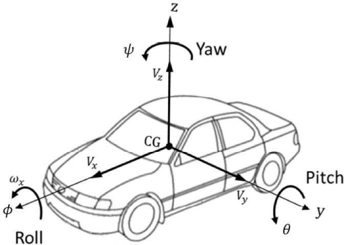
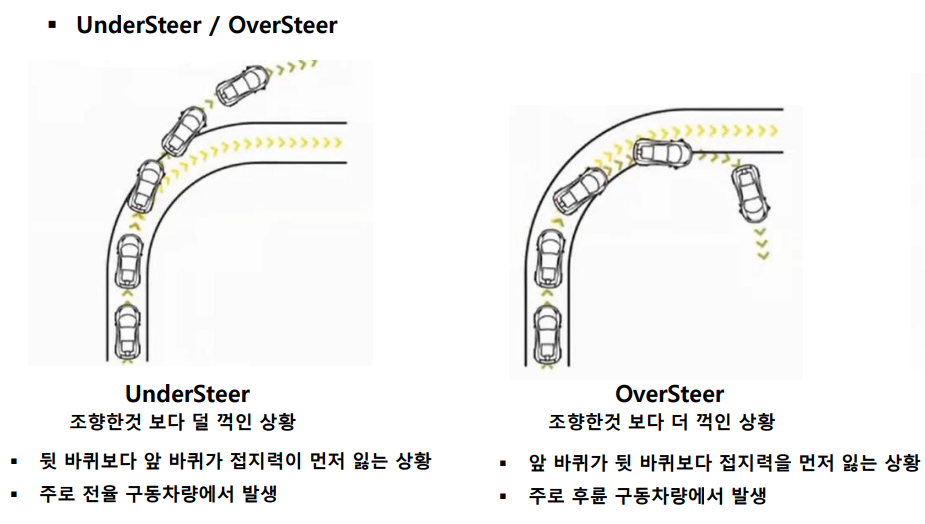
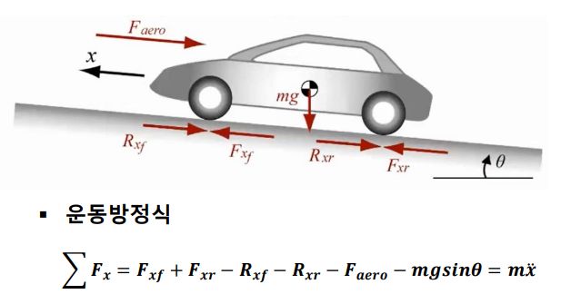

# 차량 동역학
### - CG(Center of Gravity) : 차량의 무게 중심
### - 차량의 직선운동
    x 축 : 차량의 직진방향을 의미(Longitudinal motion) / 주행, 제동
    y 축 : 차량의 횡방향을 의미(Lateral motion) / 선회성능
    z 축 : 차량의 상하방향을 의미(Vertical motion) / 승차감

### - 차량의 회전운동
    x 축 회전 : Roll
    y 축 회전 : Pitch
    z 축 회전 : Yaw

### - 자동차 = Body + Chassis
    ▪ Body : 차량의 외관 등
    ▪ Chassis(샤시) : 동력전달장치, 동력발생장치, 현가장치, 조향장치, 제동장치 등

### - 차량의 운동 성능
    ▪ 가속 성능 : 차량이 얼마나 빠르게 가속할 수 있는지를 의미하며, 엔진 출력, 구동력 전달 시스템, 공기 저항, 무게 중심 등이 영향을 미침
    ▪ 제동 성능 : 차량이 얼마나 효율적으로 감속하고 정지할 수 있는지 의미. 제동 시스템 설계, 타이어 접지력, 무게 중심 등이 주요 요소
    ▪ 조향 성능 : 차량의 조향 반응 속도와 정확도를 의미하며, 조향각, 휠베이스, 서스펜션 설정 등이 주요 요소로 작용

### - 타이어 특성
    ▪ 접지력 : 타이어와 노면 사이의 마찰을 통해 차량이 움직일 수 있는 힘 제공
    ▪ 슬립 각(Slip Angle) : 타이어의 진행 방향과 실제 진행 방향 사이의 각도. 코너링 시 발생하며 횡방향 힘과 밀접한 관련이 있음

### - 차량의 안정성
    ▪ 언더스티어(Understeer) : 코너링 시 차량의 앞바퀴가 접지력을 잃어 차량이 예상 경로보다 바깥쪽으로 나가는 현상
    ▪ 오버스티어(Oversteer) : 코너링 시 차량의 뒷바퀴가 접지력을 잃어 차량의 뒷부분이 예상 경로보다 더 회전하는 현상

###  UnderSteer/Oversteer에서 필요한 차량 모션 제어?
    차량에 추가 yaw motion이 발생하도록 제어 필요
    Sensor로 yaw 양을 측정하여 원하는 yaw motion값이 되도록 브레이크 제어

## Longitudinal Dynamics(종방향 거동)

- 차량이 가는 방향을 x방향으로 정의하여 차량의 거동을 묘사
- 차량의 대표적인 Longitudinal Control
  - (Adaptive) Cruise Control(ACC)
  - Anti-Lock Braking System(ABS)
  - Traction Control System(TCS)
- 종방향 움직임을 만들어내는 힘 평형 관계 
  - **Force 변수**
    - 𝑭𝒂𝒆𝒓𝒐 : Aerodynamics drag force
    - 𝑭𝒙𝒇/𝒙𝒓 : Longitudinal tire force
    - 𝑹𝒙𝒇/𝒙𝒓 : Rolling Resistance(구름 저항)
  - **기타 변수**
    - m : 차량 질량
    - 𝜽 : 도로 경사도
